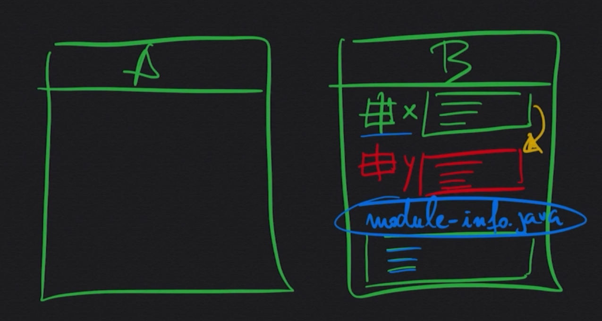
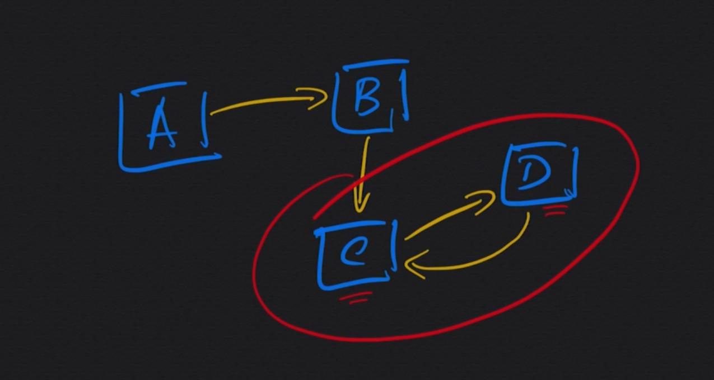

# Modularidade em Java
é criar um encapsulamento mais expecifico entre projetos que de algum modo tenham dependencias entre si.

Basica mente modularidade é um conjunto de pacotes que estarão dentro de um modulo, e você apartir desse modulo quais os pacotes que vão estar visiveis para fora do modulo e aquilo que é preciso para aquele modulo funcionar 

### Dependencia Reciprica
é quando existe uma dependencia de A para B e B para A

O modulo em java ajudam a acabar com a dependencia Reciprica