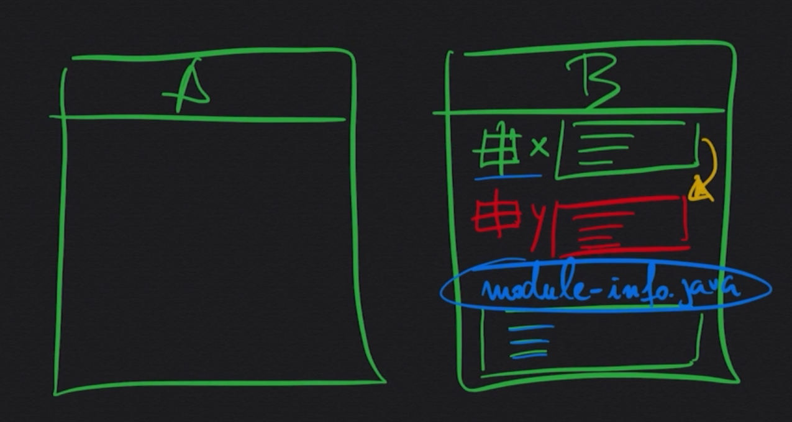
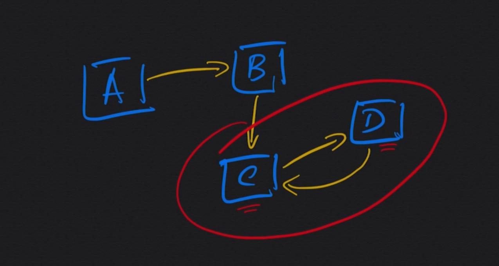

# Modularidade em Java
é criar um encapsulamento mais expecifico entre projetos que de algum modo tenham dependencias entre si.

Basica mente modularidade é um conjunto de pacotes que estarão dentro de um modulo, e você apartir desse modulo quais os pacotes que vão estar visiveis para fora do modulo e aquilo que é preciso para aquele modulo funcionar 

### Dependencia Reciprica
é quando existe uma dependencia de A para B e B para A

O modulo em java ajudam a acabar com a dependencia Reciprica

## Importar Modulo
usamos `requires` para impotar modulo
```java
module app.financeiro {
    requires java.base; // java.base é o modulo padrão do java é nele onde esta contido o java.lang
    requires app.calculo;
}
```

## Exportar Modulo
usamos o `exports` para exportar um modulo

```java
module app.calculo {
exports ao.com.as.app.financeiro.app.calculo;
}
```

### Exportar Pacote Expecifico do Modulo

```java
module app.calculo {
exports ao.com.as.app.financeiro.app.calculo
        to app.calculo;
}
```

## Exportar Modulo de um projeto com dependencia de outro projeto para um novo projeto
usamos o `transitive` para exportar a dependencia de um projeto para um novo projeto
```java
module app.calculo {
    requires transitive app.loggin; // nós temos que Calculo esta dentro de Finaceiro e Logger esta dentro de Calculo, para poder usar Logger em Finaceiro nós usamos transitive
    exports ao.com.as.app.financeiro.app.calculo;
}
```

## Pacotes Open

Quando declara que um modolo é open ele passa a permitir  que seja feito um processo de introsprecção, ou seja usar o java reflexion (pode ser usado para alterar dados privados de uma class) da acesso aos metadados de uma classe

```java
open module app.calculo {
    requires transitive app.loggin; // nós temos que Calculo esta dentro de Finaceiro e Logger esta dentro de Calculo, para poder usar Logger em Finaceiro nós usamos transitive
    exports ao.com.as.app.financeiro.app.calculo;
}
```